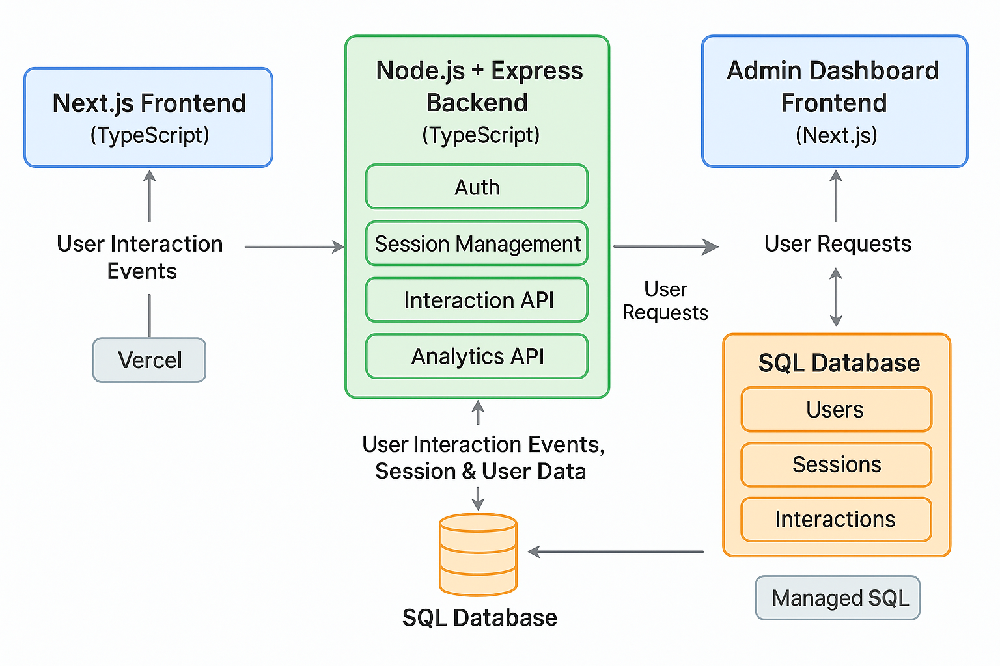

# trackkart - An E-Commerce Platform with Integrated User Behavior Tracking

## Project Overview

**trackkart** is an E-Commerce website that integrates detailed user behavior tracking along with an admin dashboard for analytics. The project focuses on scalability, efficiency, and a reusable architecture, capturing rich user interaction data during sessions to improve insights and user experience.

---

## Features Implemented

### 1. User Interface (Frontend)

- Built using **Next.js** with **TypeScript**.
- Pages implemented:
  - **Homepage**: Displays interactive Carousel along with multiple clickable categories, cards and links.
  - **Best Deals**: Features filter controls (non-functional but interactable) and a grid of product cards.
  - **Product Info Page**: Displays product details, images, and dummy action buttons (Buy, Contact Seller, Save).
- Each page includes a header and footer with dummy links and buttons.
- Uses dummy product data (e.g., One Plus Ear Buds with price, images, and seller info).
- The UI is clean, intuitive, and thoughtfully designed to provide a seamless and engaging user experience while fulfilling all core requirements.

### 2. Backend API and User Behavior Tracking

- Tech stack: **Node.js** with **Express** and **TypeScript**.
- Database: Sequelize ORM with SQL backend (PostgreSQL or MySQL).
- **User Authentication:**
  - Session-based authentication.
  - Passwords securely hashed using **bcrypt**.
- **Session Management:**
  - Tracks device info, browser info, location, and login status.
  - Only one active session per user at a time.
  - Records session start and end times.
- **User Interaction Tracking:**
  - Logs page visits and time spent on pages.
  - Captures product clicks.
  - Stores session-linked interaction records efficiently.

### 3. Admin Dashboard (Basic Implementation)

- Available under `/admin` route accessible only to role = 'admin'.
- API endpoints provide aggregated reports by date range.
- Metrics include:
  - Total unique user visits.
  - Top 3 visited pages.
  - Top 5 products clicked
  - Average time spent per page/session.
  - Counts of logged-in vs logged-out users.

---

## Database Schema

This project uses the following MySQL tables with their respective columns and types:

### `users` Table

| Column          | Type               | Key              | Description                   |
| --------------- | ------------------ | ---------------- | ----------------------------- |
| `id`            | INT AUTO_INCREMENT | PRIMARY KEY      | Unique user identifier        |
| `username`      | VARCHAR(100)       | NOT NULL         | Username                      |
| `email`         | VARCHAR(150)       | UNIQUE, NOT NULL | User email address            |
| `password_hash` | TEXT               | NOT NULL         | Hashed password               |
| `role`          | VARCHAR(10)        | NOT NULL         | User role (`user` or `admin`) |
| `created_at`    | DATETIME           | DEFAULT NOW()    | Account creation timestamp    |

---

### `sessions` Table

| Column         | Type     | Key           | Description                               |
| -------------- | -------- | ------------- | ----------------------------------------- |
| `id`           | UUID     | PRIMARY KEY   | Unique session identifier                 |
| `user_id`      | INT      | FOREIGN KEY   | References `users(id)`; nullable          |
| `location`     | TEXT     | NULLABLE      | User location info                        |
| `device_info`  | TEXT     | NULLABLE      | Device details                            |
| `browser_info` | TEXT     | NULLABLE      | Browser details                           |
| `is_logged_in` | BOOLEAN  | NOT NULL      | Whether user was logged in during session |
| `started_at`   | DATETIME | DEFAULT NOW() | Session start timestamp                   |
| `ended_at`     | DATETIME | NULLABLE      | Session end timestamp                     |

---

### `interactions` Table

| Column            | Type               | Key           | Description                          |
| ----------------- | ------------------ | ------------- | ------------------------------------ |
| `id`              | INT AUTO_INCREMENT | PRIMARY KEY   | Unique interaction record identifier |
| `user_id`         | INT                | NOT NULL      | References `users(id)`               |
| `session_id`      | VARCHAR(150)       | NOT NULL      | References `sessions(id)`            |
| `page`            | VARCHAR(150)       | NOT NULL      | Page URL or identifier               |
| `time_spent`      | INT                | NOT NULL      | Time spent on page (seconds)         |
| `product_clicked` | VARCHAR(500)       | NULLABLE      | Comma-separated product IDs clicked  |
| `timestamp`       | DATETIME           | DEFAULT NOW() | Time of the interaction              |

---

### Notes

- For security reasons, user accounts with the admin role cannot be created through the application interface. Admin roles must be assigned directly in the database by authorized personnel to ensure controlled access and prevent unauthorized privilege escalation.
- Passwords are securely hashed using bcrypt.
- Sessions allow only one active session per user.
- Interaction records capture detailed user behavior for analytics.
- UUIDs are used for session IDs to ensure uniqueness across distributed systems.

---

## Architecture FLow

[ Next.js Frontend (UI) ] <--> [ Node.js + Express Backend API ] <--> [ SQL Database (User, Session, Interaction) ]



### Components:

- **Frontend:** Pages (Home, Best Deals, Product Info), Header/Footer, Interaction event sender.
- **Backend:** Auth routes (`/signup`, `/login`), Session routes (`/session/start`, `/session/validate`, `/session/end`), Interaction logging (`/interaction`).
- **Database:** User, Session, Interaction tables with relationships.

---

## Performance & Scalability

- Efficient session management with indexes on user/session IDs.
- Interaction data stored asynchronously to avoid blocking.
- RESTful stateless APIs support horizontal scaling.
- Minimal impact on user experience while tracking.
- Extensible schema allows addition of new interaction types or metadata.

---

## Security Best Practices

- Passwords hashed with **bcrypt** and salt rounds.
- Session validation to allow only active sessions.
- Input validation and error handling on all endpoints.
- No sensitive data exposed in API responses.
- Prepared for HTTPS integration and security headers in production.

---

## Deployment

- **Frontend:** Deployed on **Vercel** (Next.js).
- **Backend:** Deployed on **Railway**(Node.js server).
- **Database:** Hosted on managed SQL service (MySQL) on **Railway**.
- Environment variables used for secrets and DB connection strings.

---

## How to Run Locally

### Backend

Add the required files in the backend which are omitted by gitignore
Eg:
backend/src/config/.env

PORT=4000
DB_HOST=localhost
DB_USER=root
DB_PASSWORD=your_password
DB_NAME=trackkart
DB_PORT=3306

```bash
cd backend
npm install
npm run dev
```

### Frontend

Replace https://trackkart-production.up.railway.app/ with http://localhost:3000/

```bash
cd frontend
npm install
npm run dev
```
